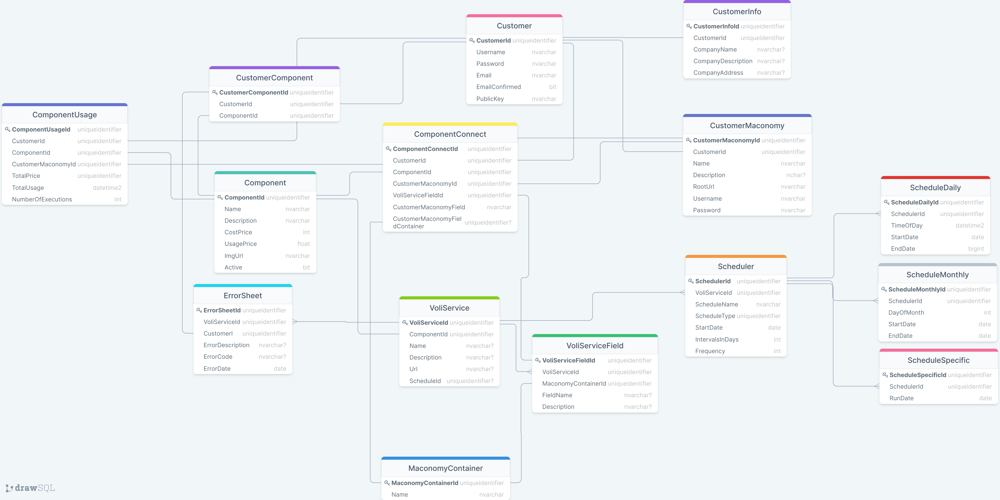

# VOLI CONNECT - ARCHITECTURE
## Last updated 28/4/2021

This page will explain in details the architecture of Voli Connect. 
Some elements of the architecture may change, since the project is still under development.

Table of content.

- Frontend (Angular)
  -   Libraries (PrimeNG, MaterialComponents etc.)
  -   Folder structure overview
  -   Additionel information like Security, routing etc.
- Server/API (NodeJS/ExpressJS)
  -   Libraries (jsonwebtoken, brcrypt, express etc.)
  -   Folder structure overview
  -   Additionel information like Security routing etc.
- Database (Postgres)
  -   Database diagram
  -   Tables, Columns and types
  -   Additionel information like Stored procedures etc.

## Frontend (Angular)
---
The frontend is built with Google's open-source Typescript based framework: Angular.
> To see how you start the frontend project, take a look in the file [GETSTARTED](./GETSTARTED.MD)

The project folder path is: Frontend/src/app.

App folder structure:

- app
  - components
    - AddMaconomyDialog
    - CrucialErrorDialog
    - LoginDialog
    - NotFound
    - SetupComponentDialog
  - dashboard
    - DashboardComponent
    - DashboardHome
    - DashboardInitialScreen
    - DashboardProfile
  - helper
  - home
    - HomeFooter
    - HomeNavbar
    - HomePage
  - model
  - service

The main pages are: 

- Landing page
- Dashboard
  - Home Screen
  - Profile Screen
  - Components Screen

## Server/API (NodeJS/Express)
---

## Database (Postgress)
---

Database diagram: 

